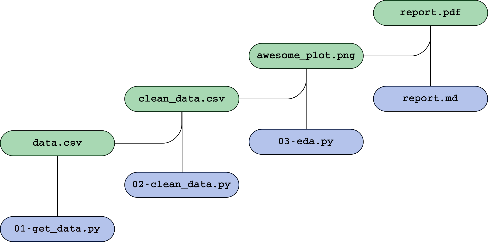

# How and Why to Make a Research Compendium

Dr. Max Joseph

Recording of the talk: https://youtu.be/g-W6fEv7Pck

## What's in here:

### `docs/`

Source code for slides from the Earth Lab webinar on 2020-03-19.
These can be viewed at https://mbjoseph.github.io/intro-research-compendia/

### `example-compendium/`

An example compendium that looks at Denver traffic in 2020.
The output of this compendium is a pdf report `report.pdf`, available at:
https://drive.google.com/file/d/197Oqu08lo2JEM2NyIbLNDJtnlcjGAA2B/view?usp=sharing

This is a simple example, designed to demonstrate:

- Using logical directory structure
- Setting rules for re-use with a LICENSE
- Separation of input and output
- Specification of a computational environment
- Coordination of multiple steps using GNU Make
- Generation of a paper or report using pandoc

An overview of the workflow is provided below:

