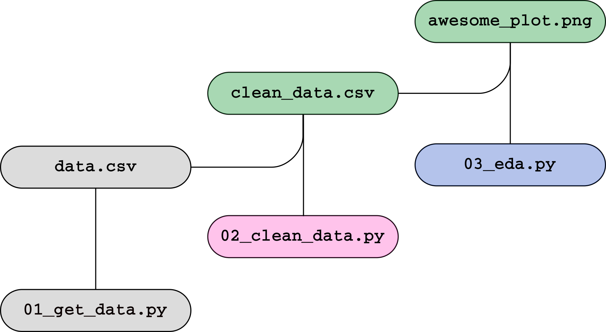

background-image: url(https://www.earthdatascience.org/images/earth-lab-logo.png)
background-position: top right
background-size: 110px 60px
layout: true


```{r setup, include=FALSE}
options(htmltools.dir.version = FALSE)
```


---

## COMPENDIUM = 
## DATA + CODE + TEXT

.center[]


.footnote[Image credit: [The Turing Way](https://github.com/alan-turing-institute/the-turing-way/raw/eda2fbba5bcb7c654ed32a0d8d13ab87d5fb6d7c/book/content/figures/ResearchCompendium.jpg)]


---

## WHY MAKE A RESEARCH COMPENDIUM?

- make it easy (for you or others) to reproduce

.center[]


.footnote[Image credit: [xkcd](https://xkcd.com/1421/)]

---


## WHY MAKE A RESEARCH COMPENDIUM?

- make it easy to reproduce
- make your work:
  - **transparent**
  - **reliable**
  - **reusable**
  - **visible**


---

## ORGANIZATION

- use a **conventional directory structure**
- **separate** data, methods, and output
- specify the computational **environment**
  
  
.footnote[
Marwick, Ben, Carl Boettiger, and Lincoln Mullen. "Packaging data analytical work reproducibly using R (and friends)." The American Statistician 72.1 (2018): 80-88.
]
---

## BASIC EXAMPLE


```
compendium/
├── data
│   ├── my_data.csv
├── analysis
│   └── my_script.R
└── README.md
```

✅ directory structure  

---

## BASIC EXAMPLE


```
compendium/
├── data
│   ├── my_data.csv
├── analysis
│   └── my_script.R
└── README.md
```

✅ directory structure  
✅ separate components  

---

## BASIC EXAMPLE


```
compendium/
├── data
│   ├── my_data.csv
├── analysis
│   └── my_script.R
└── README.md
```

✅ directory structure  
✅ separate components  
✅ environment specified  (in README)


---

## COMPONENTS

- set rules for re-use
- separate input and output
- specify a computational environment
- coordinate multiple steps
- generate a paper or report
- add automated tests*
- add interactivity*

.footnote[
\* things we won't cover today
]

---

## RULES FOR RE-USE

Choose a LICENSE!

https://choosealicense.com/

---

## THE REPRODUCIBLE RESEARCH STANDARD

Recommendations: 

- CC-BY for media (text, figures)
- MIT for code
- CC0 data (public domain)

.footnote[
Stodden, Victoria. "Enabling reproducible research: Open licensing for scientific innovation." International Journal of Communications Law and Policy, Forthcoming (2009).
]

---

## ADDING A LICENSE

```
compendium/
├── data
│   ├── my_data.csv
├── analysis
│   └── my_script.R
├── LICENSE
└── README.md
```


---

## COMPONENTS

- set rules for re-use ✅
- separate input and output 
- specify a computational environment
- coordinate multiple steps
- generate a paper or report

---

## RAW VS. COOKED

```
compendium/
├── data
│   └── raw/
│       └── my_data.csv
│   └── clean/
│       └── data_clean.csv
├── analysis
│   └── my_script.R
├── LICENSE
└── README.md
```

---

## TRACKING FIGURES

```
compendium/
├── data
│   └── raw/
│       └── my_data.csv
│   └── clean/
│       └── data_clean.csv
├── analysis
│   └── my_script.R
├── figures
│   └── awesome_plot.png
├── LICENSE
└── README.md
```

---

## ASIDE: GIT PROTIP

Do not track generated outputs

```
compendium/
├── data
│   └── raw/
│       └── my_data.csv
│   └── clean/
│       └── data_clean.csv
├── analysis
│   └── my_script.R
├── figures
│   └── awesome_plot.png
├── LICENSE
└── README.md
```

---

## GIT IGNORING FILES

Use a `.gitignore` file:

```bash
data/clean/
figures/*.png
```

---

## .gitignore

```
compendium/
├── .gitignore
├── data
│   └── raw/
│       └── my_data.csv
│   └── clean/
│       └── data_clean.csv
├── analysis
│   └── my_script.R
├── figures
│   └── awesome_plot.png
├── LICENSE
└── README.md
```


---

## COMPONENTS

- set rules for re-use ✅
- separate input and output ✅
- specify a computational environment
- coordinate multiple steps
- generate a paper or report

---

.center[]

.footnote[Image credit: [xkcd](https://xkcd.com/1987/)]

---

## ENVIRONMENT SPECIFICATION

**Python**

- `requirements.txt`
- `environment.yml`
- `setup.py`
- `Pipfile`

**R**

- `DESCRIPTION`

---

## environment.yml

```bash
name: denvertraffic
dependencies:
  - pandas
  - matplotlib
  - python=3.8
```

---


## SHOUTOUT: DOCKER

Make an executable environment!

.center[]

.footnote[
Image © Copyright Cultivate Software Ltd  
https://cultivatehq.com/posts/docker/
]

---

## UPDATED COMPENDIUM

```
compendium/
├── .gitignore
├── data
│   └── raw/
│       └── my_data.csv
│   └── clean/
│       └── data_clean.csv
├── analysis
│   └── my_script.R
├── figures
│   └── awesome_plot.png
├── LICENSE
├── environment.yml
└── README.md
```

---

## COMPONENTS

- set rules for re-use ✅
- separate input and output ✅
- specify a computational environment ✅
- coordinate multiple steps
- generate a paper or report


---

## MULTIPLE STEPS

```
compendium/
├── .gitignore
├── data
│   └── raw/
│       └── my_data.csv
│   └── clean/
│       └── data_clean.csv
├── analysis
|   ├── 03-eda.py
|   ├── 02-clean_data.py
│   └── 01-get_data.py
├── figures
│   └── awesome_plot.png
├── LICENSE
├── environment.yml
└── README.md
```

---

## A MULTISTEP WORKFLOW

.center[]

---


## EFFICIENT COMPUTATION

.center[]

`02-clean_data.py` is updated

---

## TOOLS FOR MULTISTEP WORKFLOWS

Simple

- `main.py`
- `main.sh`

Fancy

- [GNU Make](https://www.gnu.org/software/make/)
- [snakemake](https://snakemake.readthedocs.io/en/stable/) (Python)
- [drake](https://github.com/ropensci/drake) (R)


---

## GNU MAKE

A `Makefile` specifies 

1. relationships among files
2. how to generate output

---

.center[]

```bash
# target: prerequisites
#   recipe
```

---

.center[]


```bash
# target: prerequisites
#   recipe
data.csv: 01-get_data.py
  python 01-get_data.py
```


---

.center[]


```bash
# target: prerequisites
#   recipe
data.csv: 01-get_data.py
  python 01-get_data.py

clean_data.csv: data.csv 02-clean_data.py
  python 02-clean_data.py
```

---

.center[]


```bash
# target: prerequisites
#   recipe
data.csv: 01-get_data.py
  python 01-get_data.py

clean_data.csv: data.csv 02-clean_data.py
  python 02-clean_data.py

awesome_plot.png: clean_data.csv 03-eda.py
  python 03-eda.py
```


---

## Updated compendium

```
compendium/
├── .gitignore
├── data
│   └── raw/
│       └── my_data.csv
│   └── clean/
│       └── data_clean.csv
├── analysis
|   ├── 03-eda.py
|   ├── 02-clean_data.py
│   └── 01-get_data.py
├── figures
│   └── awesome_plot.png
├── LICENSE
├── environment.yml
├── Makefile
└── README.md
```


---

## COMPONENTS

- set rules for re-use ✅
- separate input and output ✅
- specify a computational environment ✅
- coordinate multiple steps ✅
- generate a paper or report


---

## GENERATING PAPERS

[pandoc](https://pandoc.org/)
- markdown $\rightarrow$ pdf, docx, html

[R Markdown](https://rmarkdown.rstudio.com/)
- R Markdown  $\rightarrow$ pdf, docx, html

[nbconvert](https://nbconvert.readthedocs.io/en/latest/)
- Jupyter notebook $\rightarrow$ pdf, html

---

## Our updated compendium

```
compendium/
├── .gitignore
├── data
│   └── raw/
│       └── my_data.csv
│   └── clean/
│       └── data_clean.csv
├── analysis
|   ├── 03-eda.py
|   ├── 02-clean_data.py
│   └── 01-get_data.py
├── figures
│   └── awesome_plot.png
├── LICENSE
├── environment.yml
├── Makefile
├── README.md
└── paper.md
```

---

## COMPONENTS

- set rules for re-use ✅
- separate input and output ✅
- specify a computational environment ✅
- coordinate multiple steps ✅
- generate a paper or report ✅

---

## SEE IT IN ACTION


GitHub: [mbjoseph/intro-research-compendia](https://github.com/mbjoseph/intro-research-compendia)

---

## RESOURCES

- [rOpenSci reprodibility guide](https://ropensci.github.io/reproducibility-guide/sections/introduction/)
- [The Turing Way](https://the-turing-way.netlify.com/introduction/introduction)
- [Browse examples on GitHub](https://github.com/topics/research-compendium/)
- [Research Compendium landing page](https://research-compendium.science/)

---

class: center, middle

# Thanks!

Slides created via the R package [**xaringan**](https://github.com/yihui/xaringan).

The chakra comes from [remark.js](https://remarkjs.com), [**knitr**](http://yihui.org/knitr), and [R Markdown](https://rmarkdown.rstudio.com).

Work funded by the NSF HDR program. 
